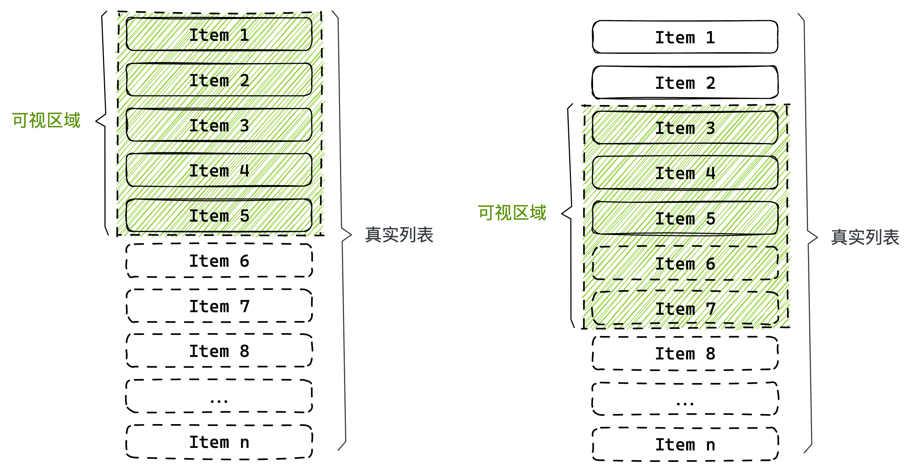
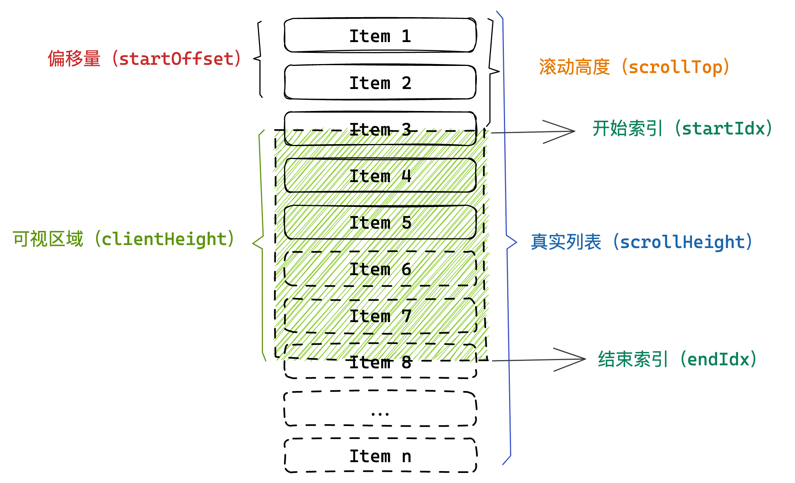
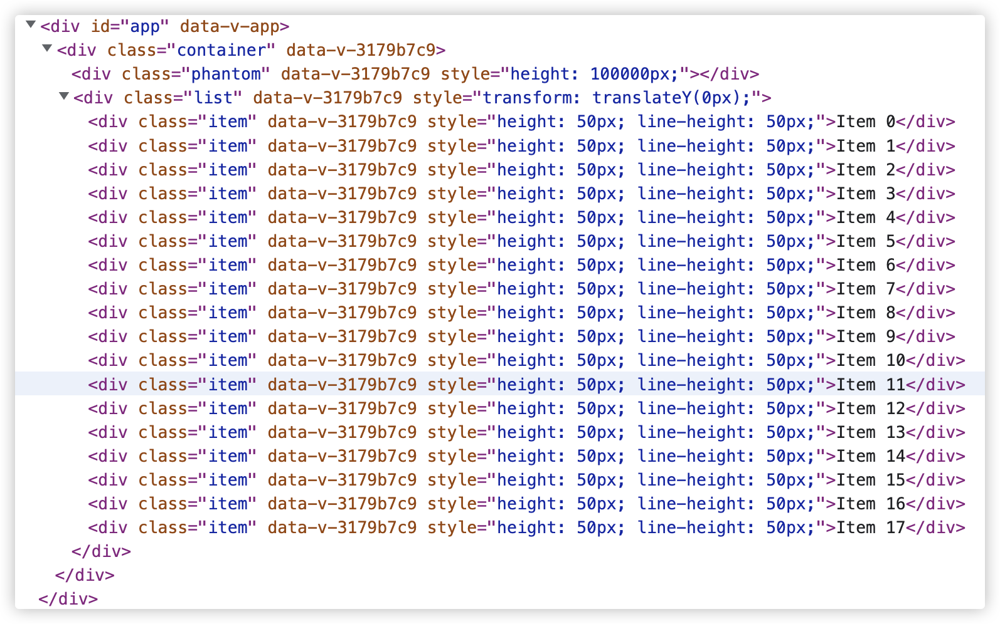
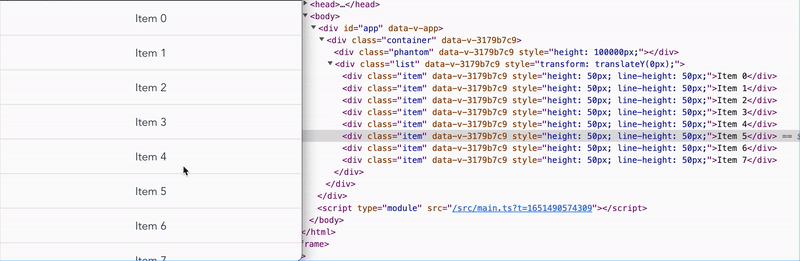

# mini-vue-virtual-list

## 长列表

通常我们将不使用分页而一次性加载并展示大量数据的列表称为长列表。

### 问题

长列表的渲染存在明显的性能问题：

- 一次性加载大量数据，耗时且占用内存空间
- 浏览器渲染数据时，计算样式计算（Recalculate Style）和布局（Layout）需要占用大量时间
- 页面DOM元素过多，交互卡顿
- ...

### 方法

- 分页加载

分页加载能解决初始时请求和渲染大量数据带来的性能消耗，但是随着不断的加载，数据仍会保留在内存中，页面中的DOM元素也会越来越多，不能根本解决问题。

- 虚拟列表

加载数据，动态计算，且只渲染可视区域内的 DOM 元素

- 分页加载 + 虚拟列表

在虚拟列表的基础上实现分页加载

## 虚拟列表

`虚拟列表` 是按需显示的一种实现，即只对`可见区域`进行渲染，对`非可见区域`中的数据不渲染或部分渲染的技术，从而达到极高的渲染性能。

假设有 10000 条数据，屏幕的可视区域为 100px，列表项的高度为 20px，屏幕中一次最多可见 5 个元素，因此首先只渲染 5 条数据。



当滚动发生后，可以通过滚动值计算得到当前可视区域应该展示的列表项，此时改变渲染的元素即可。

### 定高列表项

构建虚拟列表中，必要元素有两个

- 滚动，需要有容器能够被高度撑起，产生可滚动区域
- 列表项，被渲染元素

而列表项固定高度就可以直接计算出真实列表的高度，很容易形成滚动条；

```html
<template>
  <div class="container">
    <div class="phantom"></div>
    <div class="list">
				<!-- Item -->
    </div>
  </div>
</template>

<style scoped>
.container {
  height: 100%;
  overflow: auto;
  position: relative;
}
.phantom {
  position: absolute;
  top: 0;
  left: 0;
  right: 0;
}
.item {
  box-sizing: border-box;
  text-align: center;
  border: 1px solid #eee;
}
</style>
```

- `container` 可视区域容器
- `phantom` 滚动容器，高度为全部列表项总高度
- `list` 列表项渲染容器

完成虚拟列表的渲染需要计算几个值：



设列表数据为 `listData: any[]`，列表项高度为 `itemHeight: number`，可视区域容器 DOM 元素`container`。

- 可视区域高度（`clientHeight`），`clientHeight = container.clientHeight`
- 真实列表高度（`scrollHeight`），`scrollHeight = listData.length * itemHeight`
- 滚动高度（`scrollTop`），`scrollTop = container.scrollTop`
- 可视区域可展示列表数（`visibleCount`），`visibleCount = Math.ceil(clientHeight / itemHeight))` ，注意向上取整保证列表项虽未完全在可视区域但仍需要展示；
- 滚动偏移量（`startOffset`），初始时 `startOffset = 0`，滚动中动态计算改变，用于处理滚动过程中的列表项偏移
- 开始和结束索引（`startIdx`/`endIdx`），初始时 `startIdx = 0`，`endIdx = startIdx + visibleCount`
- 可视化区域可展示列表项（`visibleData`），初始时 `visibleData = listData.slice(startIdx, endIdx)`

完成上诉计算，初始化时的渲染就完成了，代码如下：

- 代码实例
    
    ```html
    <script setup lang="ts">
    import { ref, computed, onMounted } from 'vue';
    
    const itemHeight = 50;
    const list = Array(2000)
      .fill(0)
      .map((_, i) => ({ id: i, content: `Item ${i}` }));
    const listRef = ref();
    const clientHeight = ref(0);
    const startOffset = ref(0);
    const [startIdx, endIdx] = [ref(0), ref(0)];
    
    const scrollHeight = computed(() => list.length * itemHeight);
    const visibleCount = computed(() => Math.ceil(clientHeight.value / itemHeight));
    const visibleData = computed(() => list.slice(startIdx.value, endIdx.value));
    
    const handleScroll = () => {
      // ...
    };
    
    onMounted(() => {
      clientHeight.value = listRef.value.clientHeight;
      (startIdx.value = 0), (endIdx.value = startIdx.value + visibleCount.value);
    });
    </script>
    
    <template>
      <div ref="listRef" class="container" @scroll="handleScroll">
        <div
          class="phantom"
          :style="{ height: `${scrollHeight}px` }"
        ></div>
        <div class="list">
          <div
            class="item"
            v-for="item in visibleData"
            :key="item.id"
            :style="{
              height: `${itemHeight}px`,
              lineHeight: `${itemHeight}px`,
            }"
          >
            {{ item.content }}
          </div>
        </div>
      </div>
    </template>
    
    <style scoped>
    .container {
      height: 100%;
      overflow: auto;
      position: relative;
    }
    .phantom {
      position: absolute;
      top: 0;
      left: 0;
      right: 0;
    }
    .item {
      box-sizing: border-box;
      text-align: center;
      border: 1px solid #eee;
    }
    </style>
    ```
    



从图中可以看到，只渲染了可视区域的 18 个元素

对于虚拟列表的滚动，需要监听 `container` 元素滚动，通过动态计算来改变要渲染的元素

- `scrollTop`，当列表内容滚动后，`container` 的 `scrollTop` 会发生改变，标识当前滚动的高度
- `startIdx`，通过 scrollTop 可以计算出滚动出的元素下标，`startIdx = Math.floor(scrollTop / itemHeight)`，注意这里向下取整保证列表项未完全离开可视区域不改变  `startIdx`
- `endIdx`，始终为 `endIdx = startIdx + visibleCount`
- `startOffset` ，当滚动发生时，渲染的 DOM 元素会逐渐离开可视区域，这时可以通过 CSS 的 transform 实现元素的移动，为了不印象滚动行为，需要当一个列表项正好完全离开可视区域时，改变 transform 在 Y 轴上的值，让 DOM 再次移动回可视区域。`startOffset = scrollTop - (scrollTop % itemHeight)` ，这里 `startOffset` 只会是 itemHeight 的整数倍。

```html
<script setup lang="ts">
// ...
const handleScroll = () => {
  const scrollTop = listRef.value.scrollTop;
  startIdx.value = Math.floor(scrollTop / itemHeight);
  endIdx.value = startIdx.value + visibleCount.value;
  startOffset.value = scrollTop - (scrollTop % itemHeight);
};
</script>

<template>
  <div ref="listRef" class="container" @scroll="handleScroll">
    <div
      class="phantom"
      :style="{ height: `${scrollHeight}px` }"
    ></div>
    <div class="list" :style="{ transform: `translateY(${startOffset}px)` }">
      <div
        class="item"
        v-for="item in visibleData"
        :key="item.id"
        :style="{
          height: `${itemHeight}px`,
          lineHeight: `${itemHeight}px`,
        }"
      >
        {{ item.content }}
      </div>
    </div>
  </div>
</template>
```



从上图中可以看到 DOM 元素的变化情况

**完成代码示例如下**

[https://stackblitz.com/edit/vitejs-vite-ezwzhh?embed=1&file=src/components/VirtualList.vue&hideExplorer=1&hideNavigation=1&view=preview](https://stackblitz.com/edit/vitejs-vite-ezwzhh?embed=1&file=src/components/VirtualList.vue&hideExplorer=1&hideNavigation=1&view=preview)

## 动态高度列表项

实际应用中，也会存在列表高度不固定的情况，这样就不能计算列表项的总高度、滚动时的显示数据和对应的偏移量；

动态高度的解决方案：

1. 对组件属性`itemHeight`进行扩展，支持传递类型为`数字`、`数组`、`函数`
    - 固定值，与定高列表相同
    - 数组，包含所有数据高度的列表
    - 函数，`(idx: number) ⇒ number` ，根据索引返回高度的函数
    
    具有很好的灵活性，但仍需要预先得到或通过计算得到列表项的高度，无法列表项被内容撑开的情况
    
2. 将列表项渲染到屏幕外，对其高度进行测量并缓存，然后再将其渲染至可视区域内
    
    这种做法在大量数据的情况下，仍开销很大
    
3. 先以预估高度渲染，然后获取真实高度并缓存，再更新原来的预设高度；

显然第三种做法是比较合适的；
